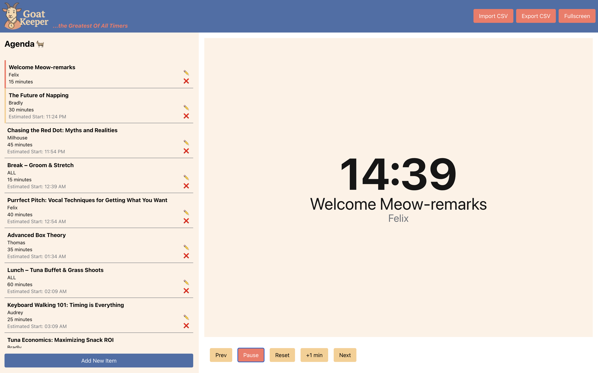

# 🐐 Goatkeeper 🐐

**Goatkeeper** is a meeting facilitation tool that helps you stay on time, stay focused, and steer through packed agendas with grace. Designed for live onsite events and working sessions, it combines a real-time countdown timer with a clear visual agenda and flexible controls to adjust as things shift.

Import your agenda, share your screen, and let Goatkeeper do the timekeeping — so you can focus on the conversations that matter.

## ✨ Features

- 🗓️ **Agenda Management:** Add, edit, and reorder agenda items with drag-and-drop.
- ⏱️ **Large Timer Display:** A clear, easy-to-read countdown timer for the current agenda item.
- 🎨 **Visual Alerts:** The timer flashes at 5 and 2 minutes remaining, and turns red when time is up.
- 📂 **CSV Import/Export:** Easily import and export your agenda.
- 💾 **Auto-Save:** Your agenda is automatically saved in your browser's local storage.
- 🖥️ **Fullscreen Mode:** A distraction-free view for projecting the timer.
- 📜 **Scrollable Agenda:** The agenda list is scrollable for long agendas.
- 𝘏 **Collapsible Form:** The "Add Item" form can be shown or hidden.

## 🚀 Getting Started

1.  **Launch the App:** Open the provided URL in your web browser.
2.  **Add Agenda Items:**
    *   Click the "Add New Item" button to show the form.
    *   Fill in the title, presenter, and duration (in minutes).
    *   Click "Add Item" to add it to the agenda.
3.  **Edit Agenda Items:**
    *   Click the pencil icon on an agenda item to make changes.
    *   Click "Save" to save your changes.
4.  **Reorder Agenda Items:**
    *   Click and drag an agenda item to reorder it.
5.  **Control the Timer:**
    *   **Start/Pause:** Start or pause the timer.
    *   **Reset:** Reset the timer to the original duration.
    *   **+1 min:** Add one minute to the current time.
    *   **Prev/Next:** Move to the previous or next agenda item.
6.  **Import/Export CSV:**
    *   **Import:** Click "Import CSV" to upload a CSV file with your agenda. CSV headers are "id,title,presenter,duration" See sample-agenda.csv for an example.
    *   **Export:** Click "Export CSV" to download the current agenda as a CSV file.
8.  **Fullscreen Mode:**
    *   Click "Fullscreen" to enter a distraction-free view.
    *   Press the "Esc" key to exit fullscreen mode.

##  Browser Requirements

This app is designed to work in modern web browsers like Chrome, Firefox, and Safari.

## 💡 Tips for Success

*   **Prepare Your Agenda:** Use the CSV import feature to quickly populate your agenda.
*   **Test Before You Go Live:** Familiarize yourself with the app's features before your event.
*   **Keep it Simple:** The app is designed to be simple and intuitive. Don't overcomplicate your life.
*   **Take breaks:** Plan breaks into your schedule ahead of time and stick to them.
*   **Accept change:** Nothing ever goes exactly as planned -- that's why there's an edit button!

##  Known Limitations

*   This app is designed for single-user operation. It does not support real-time collaboration.
*   The agenda is saved in your browser's local storage. Clearing your browser data will delete your agenda.
